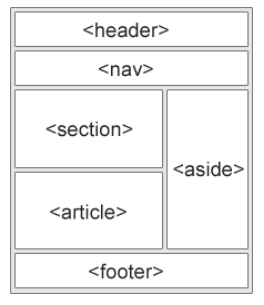
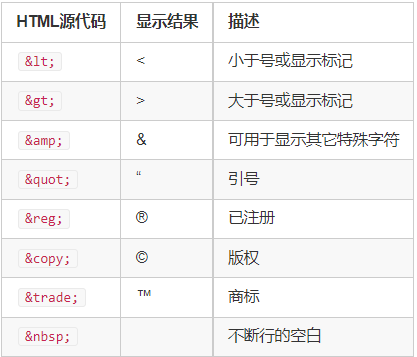

# Web前端基础课

https://www.acwing.com/activity/content/1150/

https://developer.mozilla.org/zh-CN/


## 【1】html

#### 【1】文件结构

#### 【2】文本标签

#### 【3】图片

#### 【4】音频与视频

#### 【5】超链接

#### 【6】表单

#### 【7】列表

#### 【8】表格

```html
<table>标签
HTML的 table 元素表示表格数据 — 即通过二维数据表表示的信息。

<thead>标签
HTML的<thead>元素定义了一组定义表格的列头的行。

<tbody>标签
HTML的<tbody>元素定义一组数据行。

<tr>标签
HTML <tr> 元素定义表格中的行。 同一行可同时出现<td> 和<th> 元素。

<th>标签
HTML <th>元素定义表格内的表头单元格。

<td>标签
HTML <td> 元素 定义了一个包含数据的表格单元格。

<caption>标签
HTML <caption> 元素 (or HTML 表格标题元素) 展示一个表格的标题， 它常常作为 <table> 的第一个子元素出现，同时显示在表格内容的最前面，但是，它同样可以被 CSS 样式化，所以，它同样可以出现在相对于表格的任意位置。
```

#### 【9】语义标签



```html
<nav>
HTML <nav>元素表示页面的一部分，其目的是在当前文档或其他文档中提供导航链接。导航部分的常见示例是菜单，目录和索引。

<section>
HTML <section>元素表示一个包含在 HTML 文档中的独立部分，它没有更具体的语义元素来表示，一般来说会有包含一个标题。
    
<header>
HTML <header> 元素用于展示介绍性内容，通常包含一组介绍性的或是辅助导航的实用元素。它可能包含一些标题元素，但也可能包含其他元素，比如 Logo、搜索框、作者名称，等等。
    
<figure>
HTML <figure> 元素代表一段独立的内容，经常与说明（caption）<figcaption> 配合使用，并且作为一个独立的引用单元。当它属于主内容流（main flow）时，它的位置独立于主体。这个标签经常是在主文中引用的图片，插图，表格，代码段等等，当这部分转移到附录中或者其他页面时不会影响到主体。
    
<figcaption>
HTML <figcaption> 元素 是与其相关联的图片的说明/标题，用于描述其父节点 <figure> 元素里的其他数据。这意味着 <figcaption> 在<figure> 块里是第一个或最后一个。同时 HTML Figcaption 元素是可选的；如果没有该元素，这个父节点的图片只是会没有说明/标题。

<article>
HTML <article>元素表示文档、页面、应用或网站中的独立结构，其意在成为可独立分配的或可复用的结构，如在发布中，它可能是论坛帖子、杂志或新闻文章、博客、用户提交的评论、交互式组件，或者其他独立的内容项目。
    
<aside>
HTML <aside> 元素表示一个和其余页面内容几乎无关的部分，被认为是独立于该内容的一部分并且可以被单独的拆分出来而不会使整体受影响。其通常表现为侧边栏或者标注框（call-out boxes）。
    
<footer>
HTML <footer> 元素表示最近一个章节内容或者根节点（sectioning root ）元素的页脚。一个页脚通常包含该章节作者、版权数据或者与文档相关的链接等信息。
```


#### 【10】特殊符号




## 【2】css

#### 【1】样式定义方式

#### 【2】选择器

```css
(1)标签选择器
选择所有div标签：
div {
    width: 200px;
    height: 200px;
    background-color: gray;
}

(2)ID选择器
选择ID为rect-1的标签：

#rect-1 {
    width: 200px;
    height: 200px;
    background-color: gray;
}

(3)类选择器
选择所有rectangle类的标签：

.rectangle {
    width: 200px;
    height: 200px;
    background-color: gray;
}

(4)伪类选择器
	伪类用于定义元素的特殊状态。

    (4-1)链接伪类选择器：

    :link：链接访问前的样式
    :visited：链接访问后的样式
    :hover：鼠标悬停时的样式
    :active：鼠标点击后长按时的样式
    :focus：聚焦后的样式

    (4-2)位置伪类选择器：
    :nth-child(n)：选择是其父标签第n个子元素的所有元素。
    (4-3)目标伪类选择器：
    :target：当url指向该元素时生效。

(5)复合选择器
由两个及以上基础选择器组合而成的选择器。
element1, element2：同时选择元素element1和元素element2。
element.class：选则包含某类的element元素。
element1 + element2：选择紧跟element1的element2元素。
element1 element2：选择element1内的所有element2元素。
element1 > element2：选择父标签是element1的所有element2元素。

(6)
通配符选择器
*：选择所有标签
[attribute]：选择具有某个属性的所有标签
[attribute=value]：选择attribute值为value的所有标签

(7)伪元素选择器
将特定内容当做一个元素，选择这些元素的选择器被称为伪元素选择器。
::first-letter：选择第一个字母
::first-line：选择第一行
::selection：选择已被选中的内容
::after：可以在元素后插入内容
::before：可以在元素前插入内容

(8)样式渲染优先级
	权重大小，越具体的选择器权重越大：!important > 行内样式 > ID选择器 > 类与伪类选择器 > 标签选择器 > 通用选择器
	权重相同时，后面的样式会覆盖前面的样式
	继承自父元素的权重最低
```


#### 【3】颜色

#### 【4】文本

| 单位 | 描述                     |
| ---- | ------------------------ |
| px   | 设备上的像素点           |
| %    | 相对于父元素的百分比     |
| em   | 相对于当前元素的字体大小 |
| rem  | 相对于根元素的字体大小   |
| vw   | 相对于视窗宽度的百分比   |
| vh   | 相对于视窗高度的百分比   |

```css
(1)text-align
text-align CSS属性定义行内内容（例如文字）如何相对它的块父元素对齐。text-align 并不控制块元素自己的对齐，只控制它的行内内容的对齐。

(2)line-height
line-height CSS 属性用于设置多行元素的空间量，如多行文本的间距。对于块级元素，它指定元素行盒（line boxes）的最小高度。对于非替代的 inline 元素，它用于计算行盒（line box）的高度。

(3)letter-spacing
CSS 的 letter-spacing 属性用于设置文本字符的间距。

(4)text-indent
text-indent属性能定义一个块元素首行文本内容之前的缩进量。

(5)text-decoration
text-decoration 这个 CSS 属性是用于设置文本的修饰线外观的（下划线、上划线、贯穿线/删除线 或 闪烁）它是 text-decoration-line, text-decoration-color, text-decoration-style, 和新出现的 text-decoration-thickness 属性的缩写。

(6)text-shadow
text-shadow为文字添加阴影。可以为文字与 text-decorations 添加多个阴影，阴影值之间用逗号隔开。每个阴影值由元素在X和Y方向的偏移量、模糊半径和颜色值组成。
```


#### 【5】字体

#### 【6】背景

#### 【7】边框

#### 【8】元素展示格式

```css
(1)display
	block：
        独占一行
        width、height、margin、padding均可控制
        width默认100%。
    inline：
        可以共占一行
        width与height无效，水平方向的margin与padding有效，竖直方向的margin与padding无效
        width默认为本身内容宽度
    inline-block
        可以共占一行
        width、height、margin、padding均可控制
        width默认为本身内容宽度

(2)white-space
    white-space CSS 属性是用来设置如何处理元素中的 空白 (en-US)。

(3)text-overflow
text-overflow CSS 属性确定如何向用户发出未显示的溢出内容信号。它可以被剪切，显示一个省略号或显示一个自定义字符串。

(4)overflow
CSS属性 overflow 定义当一个元素的内容太大而无法适应 块级格式化上下文 时候该做什么。它是 overflow-x 和overflow-y的 简写属性 。
```


#### 【9】内外边距

```css
(1)margin
margin属性为给定元素设置所有四个（上下左右）方向的外边距属性。

    可以接受1~4个值（上、右、下、左的顺序）
    可以分别指明四个方向：margin-top、margin-right、margin-bottom、margin-left
    可取值
        length：固定值
        percentage：相对于包含块的宽度，以百分比值为外边距。
        auto：让浏览器自己选择一个合适的外边距。有时，在一些特殊情况下，该值可以使元素居中。
    外边距重叠
    	块的上外边距(margin-top)和下外边距(margin-bottom)有时合并(折叠)为单个边距，其大小为单个边距的最大值(或如果它们相等，则仅为其中一个)，这种行为称为边距折叠。
    	父元素与后代元素：父元素没有上边框和padding时，后代元素的margin-top会溢出，溢出后父元素的margin-top会与后代元素取最大值。

(2)padding
padding CSS 简写属性控制元素所有四条边的内边距区域。

    可以接受1~4个值（上、右、下、左的顺序）
    可以分别指明四个方向：padding-top、padding-right、padding-bottom、padding-left
    可取值
        length：固定值
        percentage：相对于包含块的宽度，以百分比值为内边距。
```


#### 【10】盒子模型

```css
box-sizing
CSS 中的 box-sizing 属性定义了 user agent 应该如何计算一个元素的总宽度和总高度。
    content-box：是默认值，设置border和padding均会增加元素的宽高。
    border-box：设置border和padding不会改变元素的宽高，而是挤占内容区域。
```


#### 【11】位置

#### 【12】浮动

#### 【13】flex布局

flex CSS简写属性设置了弹性项目如何增大或缩小以适应其弹性容器中可用的空间。

```css
(1)flex-direction
CSS flex-direction 属性指定了内部元素是如何在 flex 容器中布局的，定义了主轴的方向(正方向或反方向)。
    取值：
    row：flex容器的主轴被定义为与文本方向相同。 主轴起点和主轴终点与内容方向相同。
    row-reverse：表现和row相同，但是置换了主轴起点和主轴终点。
    column：flex容器的主轴和块轴相同。主轴起点与主轴终点和书写模式的前后点相同
    column-reverse：表现和column相同，但是置换了主轴起点和主轴终点

(2)flex-wrap
CSS 的 flex-wrap 属性指定 flex 元素单行显示还是多行显示。如果允许换行，这个属性允许你控制行的堆叠方向。
    取值：
    nowrap：默认值。不换行。
    wrap：换行，第一行在上方。
    wrap-reverse：换行，第一行在下方。

(3)flex-flow
CSS flex-flow 属性是 flex-direction 和 flex-wrap 的简写。默认值为：row nowrap。

(4)justify-content
CSS justify-content 属性定义了浏览器之间，如何分配顺着弹性容器主轴(或者网格行轴) 的元素之间及其周围的空间。
	取值：
        flex-start：默认值。左对齐。
        flex-end：右对齐。
        space-between：左右两段对齐。
        space-around：在每行上均匀分配弹性元素。相邻元素间距离相同。每行第一个元素到行首的距离和每行最后一个元素到行尾的距离将会是相邻元素之间距离的一半。
        space-evenly：flex项都沿着主轴均匀分布在指定的对齐容器中。相邻flex项之间的间距，主轴起始位置到第一个flex项的间距，主轴结束位置到最后一个flex项的间距，都完全一样。

(5)align-items
CSS align-items属性将所有直接子节点上的align-self值设置为一个组。 align-self属性设置项目在其包含块中在交叉轴方向上的对齐方式。
    取值：
        flex-start：元素向主轴起点对齐。
        flex-end：元素向主轴终点对齐。
        center：元素在侧轴居中。
        stretch：弹性元素被在侧轴方向被拉伸到与容器相同的高度或宽度。

(6)align-content
CSS 的 align-content 属性设置了浏览器如何沿着弹性盒子布局的纵轴和网格布局的主轴在内容项之间和周围分配空间。
    取值：
        flex-start：所有行从垂直轴起点开始填充。第一行的垂直轴起点边和容器的垂直轴起点边对齐。接下来的每一行紧跟前一行。
        flex-end：所有行从垂直轴末尾开始填充。最后一行的垂直轴终点和容器的垂直轴终点对齐。同时所有后续行与前一个对齐。
        center：所有行朝向容器的中心填充。每行互相紧挨，相对于容器居中对齐。容器的垂直轴起点边和第一行的距离相等于容器的垂直轴终点边和最后一行的距离。
        stretch：拉伸所有行来填满剩余空间。剩余空间平均地分配给每一行。

(7)order
定义flex项目的顺序，值越小越靠前。

(8)flex-grow
CSS 属性 flex-grow CSS 设置 flex 项主尺寸 的 flex 增长系数。
负值无效，默认为 0。

(9)flex-shrink
CSS flex-shrink 属性指定了 flex 元素的收缩规则。flex 元素仅在默认宽度之和大于容器的时候才会发生收缩，其收缩的大小是依据 flex-shrink 的值。
负值无效，默认为1。

(10)flex-basis
CSS 属性 flex-basis 指定了 flex 元素在主轴方向上的初始大小。
	取值：
		width 值可以是 <length>; 该值也可以是一个相对于其父弹性盒容器主轴尺寸的百分数 。负值是不被允许的。默认为 auto。

(11)flex
flex-grow、flex-shrink、flex-basis的缩写。
    常用取值：
        auto：flex: 1 1 auto
        none：flex: 0 0 auto
```


#### 【14】响应式布局


## 【3】JavaScript

#### 【1】JS的调用方式与执行顺序

常见使用方式有以下几种：

​		直接在<script type="module"></script>标签内写JS代码。
​		直接引入文件：<script type="module" src="/static/js/index.js"></script>。
​		将所需的代码通过import关键字引入到当前作用域。

#### 【2】变量与运算符

#### 【3】输入和输出

#### 【4】判断语句

#### 【5】循环语句

#### 【6】对象

#### 【7】数组

数组的常用属性和函数
	属性length：返回数组长度。注意length是属性，不是函数，因此调用的时候不要加()
	函数push()：向数组末尾添加元素
	函数pop()：删除数组末尾的元素
	函数splice(a, b)：删除从a开始的b个元素
	函数sort()：将整个数组从小到大排序
	自定义比较函数：array.sort(cmp)，函数cmp输入两个需要比较的元素，返回一个实数，负数表示第一个参数小于第二个参数，0表示相等，正数表示大于。

#### 【8】函数

```javascript
function add(a, b) {
    return a + b;
}

let add = function (a, b) {
    return a + b;
}

let add = (a, b) => {
    return a + b;
}
```

#### 【9】类

#### 【10】事件

JavaScript的代码一般通过事件触发。可以通过addEventListener函数为元素绑定事件的触发函数。

常见的触发函数有：

（1）鼠标
		click：鼠标左键点击
		dblclick：鼠标左键双击
		contextmenu：鼠标右键点击
		mousedown：鼠标按下，包括左键、滚轮、右键
		event.button：0表示左键，1表示中键，2表示右键
		mouseup：鼠标弹起，包括左键、滚轮、右键
		event.button：0表示左键，1表示中键，2表示右键

（2）键盘
		keydown：某个键是否被按住，事件会连续触发
		event.code：返回按的是哪个键
		event.altKey、event.ctrlKey、event.shiftKey分别表示是否同时按下了alt、ctrl、shift键。
		keyup：某个按键是否被释放
		event常用属性同上
		keypress：紧跟在keydown事件后触发，只有按下字符键时触发。适用于判定用户输入的字符。
		event常用属性同上
		keydown、keyup、keypress的关系类似于鼠标的mousedown、mouseup、click

（3）表单
		focus：聚焦某个元素
		blur：取消聚焦某个元素
		change：某个元素的内容发生了改变

（4）窗口
		需要作用到window元素上。

​		resize：当窗口大小放生变化
​		scroll：滚动指定的元素
​		load：当元素被加载完成


#### 【11】常用库

##### 【11-1】JQuery

（1）使用方式：在<head>元素中添加：
<script src="https://cdn.acwing.com/static/jquery/js/jquery-3.3.1.min.js"></script>

（2）选择器

$(selector)，例如：

```javascript
$(selector)，例如：

$('div');
$('.big-div');
$('div > p')
selector类似于CSS选择器。
```

（3）事件

```javascript
$(selector).on(event, func)绑定事件，例如：

$('div').on('click', function (e) {
    console.log("click div");
})
$(selector).off(event, func)删除事件，例如：

$('div').on('click', function (e) {
    console.log("click div");

    $('div').off('click');
});
当存在多个相同类型的事件触发函数时，可以通过click.name来区分，例如：

$('div').on('click.first', function (e) {
    console.log("click div");

    $('div').off('click.first');
});
在事件触发的函数中的return false等价于同时执行：

e.stopPropagation()：阻止事件向上传递
e.preventDefault()：阻止事件的默认行为
```

（4）元素的隐藏、展现

```javascript
$A.hide()：隐藏，可以添加参数，表示消失时间
$A.show()：展现，可以添加参数，表示出现时间
$A.fadeOut()：慢慢消失，可以添加参数，表示消失时间
$A.fadeIn()：慢慢出现，可以添加参数，表示出现时间
```

（5）元素添加删除

```javascript
$('<div class="mydiv"><span>Hello World</span></div>')：构造一个jQuery对象
$A.append($B)：将$B添加到$A的末尾
$A.prepend($B)：将$B添加到$A的开头
$A.remove()：删除元素$A
$A.empty()：清空元素$A的所有儿子
```

（6）对类的操作

```javascript
$A.addClass(class_name)：添加某个类
$A.removeClass(class_name)：删除某个类
$A.hasClass(class_name)：判断某个类是否存在
```

（7）对CSS的操作

```javascript
$('div').css({
    width: "200px",
    height: "200px",
    "background-color": "orange",
});
```

（8）对标签属性的操作

```javascript
$('div').attr('id')：获取属性
$('div').attr('id', 'ID')：设置属性
```

（9）对html内容、文本的操作

```javascript
$A.html()：获取、修改HTML内容
$A.text()：获取、修改文本信息
$A.val()：获取、修改文本的值
```

（10）查找

```javascript
$(selector).parent(filter)：查找父元素
$(selector).parents(filter)：查找所有祖先元素
$(selector).children(filter)：在所有子元素中查找
$(selector).find(filter)：在所有后代元素中查找
```

（11）ajax

```javascript
GET方法：
$.ajax({
    url: url,
    type: "GET",
    data: {
    },
    dataType: "json",
    success: function (resp) {

    },
});

POST方法：
$.ajax({
    url: url,
    type: "POST",
    data: {
    },
    dataType: "json",
    success: function (resp) {

    },
});
```

##### 【2】setTimeout与setInterval

setTimeout(func, delay) -> delay毫秒后，执行函数func()。

clearTimeout(timeout_id);  清除定时器

setInterval(func, delay) -> 每隔delay毫秒，执行一次函数func()。第一次在第delay毫秒后执行。

clearInterval(interval_id);  清除周期执行的函数

##### 【3】requestAnimationFrame

requestAnimationFrame(func)
该函数会在下次浏览器刷新页面之前执行一次，通常会用递归写法使其每秒执行60次func函数。调用时会传入一个参数，表示函数执行的时间戳，单位为毫秒。


与setTimeout和setInterval的区别：

​		requestAnimationFrame渲染动画的效果更好，性能更加。
该函数可以保证每两次调用之间的时间间隔相同，但setTimeout与setInterval不能保证这点。				setTmeout两次调用之间的间隔包含回调函数的执行时间；setInterval只能保证按固定时间间隔将回调函数压入栈中，但具体的执行时间间隔仍然受回调函数的执行时间影响。
​		当页面在后台时，因为页面不再渲染，因此requestAnimationFrame不再执行。但setTimeout与setInterval函数会继续执行。

##### 【4】Map与Set


##### 【5】localStorage

可以在用户的浏览器上存储键值对。

常用API：

​		setItem(key, value)：插入
​		getItem(key)：查找
​		removeItem(key)：删除
​		clear()：清空

##### 【6】JSON

JSON对象用于序列化对象、数组、数值、字符串、布尔值和null。

常用API：

​		JSON.parse()：将字符串解析成对象
​		JSON.stringify()：将对象转化为字符串

##### 【7】日期

与Date对象的实例相关的API：

new Date()：返回现在时刻。
new Date("2022-04-15T15:30:00.000+08:00")：返回北京时间2022年4月15日 15:30:00的时刻。
两个Date对象实例的差值为毫秒数
getDay()：返回星期，0表示星期日，1-6表示星期一至星期六
getDate()：返回日，数值为1-31
getMonth()：返回月，数值为0-11
getFullYear()：返回年份
getHours()：返回小时
getMinutes()：返回分钟
getSeconds()：返回秒
getMilliseconds()：返回毫秒

##### 【8】WebSocket

与服务器建立全双工连接。

常用API：

​		new WebSocket('ws://localhost:8080');：建立ws连接。
​		send()：向服务器端发送一个字符串。一般用JSON将传入的对象序列化为字符串。
​		onopen：类似于onclick，当连接建立时触发。
​		onmessage：当从服务器端接收到消息时触发。
​		close()：关闭连接。
​		onclose：当连接关闭后触发。

##### 【9】window

window.open("https://www.acwing.com")在新标签栏中打开页面。
location.reload()刷新页面。
location.href = "https://www.acwing.com"：在当前标签栏中打开页面。

##### 【10】canvas

https://developer.mozilla.org/zh-CN/docs/Web/API/Canvas_API/Tutorial


## 【4】中期项目——拳皇


## 【5】React

#### 【1】配置环境

（1）安装Reaction

https://gitforwindows.org/

（2）安装Node.js

https://nodejs.org/en/

（3）安装create-react-app

```shell
npm i -g create-react-app
```

（4）安装VSCode插件

​		Simple React Snippets
​		Prettier - Code formatter

（5）创建React App

```shell
create-react-app react-app  # 可以替换为其他app名称

cd react-app
npm start  # 启动应用
```

（6）安装并引入bootstrap

```shell
npm i bootstrap
```

```jsx
import 'bootstrap/dist/css/bootstrap.css';
```

（7）JSX
		React中的一种语言，会被Babel编译成标准JavaScript。

#### 【2】ES6语法补充

（1）使用bind()绑定this取值

在JavaScript中，函数里的this指向的是执行时的调用者，而非定义时所在的对象。


（2）箭头函数

```jsx
//1 简写方式
const f = (x) => {
  return x * x;
};
const f = x => x * x;

//2 箭头函数不重新绑定 this 取值
const person = {
  talk: function() {
    setTimeout(function() {
      console.log(this);
    }, 1000);
  }
};
person.talk();  // 输出Window

const person = {
  talk: function() {
    setTimeout(() => {
      console.log(this);
    }, 1000);
  }
};
person.talk();  // 输出 {talk: f}
```

（3）对象解构

```jsx
const person = {
  name: "yxc",
  age: 18,
  height: 180,
};

const {name : nm, age} = person;  // nm是name的别名
```

（4）数组和对象的展开

```jsx
let a = [1, 2, 3];
let b = [...a];  // b是a的复制
let c = [...a, 4, 5, 6];

const a = {name: "yxc"};
const b = {age: 18};
const c = {...a, ...b, height: 180};
```

（5）Named 与 Default exports

​		Named：可以export多个，import的时候需要加大括号，名称需要匹配
​		Default Export：最多export一个，import的时候不需要加大括号，可以直接定义别名


#### 【3】Components

jsx文件中快捷键，imrc引入头文件，cc定义类，sfc定义函数

```jsx
import React, { Component } from 'react';

class NotFound extends Component {
    state = {  } 
    render() { 
        return ();
    }
}

export default NotFound;
```

（1）创建按钮

当子节点数量大于1时，可以用<div>或<React.Fragment>将其括起来。

（2）内嵌表达式

JSX中使用 {} 嵌入表达式

（3）设置属性

​		class -> className
​		CSS属性：background-color -> backgroundColor，其它属性类似

（4）数据驱动改变Style

（5）渲染列表

​		使用map函数
​		每个元素需要具有唯一的key属性，用来帮助React快速找到被修改的DOM元素。

```jsx
const boxes = this.state.boxes.map(
    b => {
        return{
            id: b.id,
            x: 0
        }
    });
```

（6）Conditional Rendering
利用逻辑表达式的短路原则。
		与表达式中 expr1 && expr2，当expr1为假时返回expr1的值，否则返回expr2的值
		或表达式中 expr1 || expr2，当expr1为真时返回expr1的值，否则返回expr2的值

（7）修改state
		需要使用this.setState()函数
		每次调用this.setState()函数后，会重新调用this.render()函数，用来修改虚拟DOM树。React只会修改不同步的实际DOM树节点。


#### 【4】组合Components

（1）从上到下传递数据

通过 this.props 属性可以从上到下传递数据。

（2）传递子节点

通过 this.props.children 属性传递子节点

（3）从下到上调用函数

注意：每个组件的 this.state 只能在组件内部修改，不能在其他组件内修改。

（4）每个维护的数据仅能保存在一个this.state中

不要直接修改this.state的值，因为setState函数可能会将修改覆盖掉。

（5）无状态函数组件 SFC

​		当组件中没有用到this.state时，可以简写为无状态的函数组件。
​		函数的传入参数为props对象

（6）组件的生命周期

​		Mount周期，执行顺序：constructor() -> render() -> componentDidMount()
​		Update周期，执行顺序：render() -> componentDidUpdate()
​		Unmount周期，执行顺序：componentWillUnmount()

1. Mount周期中的componentDidMount()函数在执行时表明，当前页面元素加载完毕，因此可以通过ajax请求获取数据填充上去
2. Update周期中的componentDidUpdate(prevProps, prevState)可以填两个参数，应用在：对比 this.state 与 prevState的区别，从而去更新数据库
3. Unmount周期中的componentWillUnmount()是在删除前执行函数，因此可以在此函数更新全局状态


#### 【5】路由

（1）Web分类

静态页面：页面里的数据是写死的
动态页面：页面里的数据是动态填充的
		后端渲染：数据在后端填充
		前端渲染：数据在前端填充

（2）环境配置

​		VSCODE安装插件：Auto Import - ES6, TS, JSX, TSX
​		安装Route组件：npm i react-router-dom

（3）Route组件

​		BrowserRouter：所有需要路由的组件，都要包裹在BrowserRouter组件内
​		Link：跳转到某个链接，to属性表示跳转到的链接
​		Routes：类似于C++中的switch，匹配第一个路径
​		Route：路由，path属性表示路径，element属性表示路由到的内容

（4）URL中传递参数

方式一 Restful风格：

解析URL：

<Route path="/linux/:chapter_id/:section_id/" element={<Linux />} />

类组件

```jsx
import React, { Component } from 'react';
import { useParams } from 'react-router-dom';

class WebContent extends Component {
    state = {  } 
    render() { 
        return (
            <React.Fragment>
                <h2>Web - {this.props.params.chapter}</h2>
            </React.Fragment>

        );
    }
}
 
 
export default (props) => (
    <WebContent
        {...props}
        params={useParams()}
    />
);
```

函数组件

```jsx
import React, { Component } from 'react';
import { useParams } from 'react-router-dom';

const Linux = () => {
    console.log(useParams());
    return (<h1>Linux</h1>);
}

export default Linux;
```

方式二：

<Link to={`/web/content?chapter=${web.id}`}> </Link>

类组件

```jsx
import React, { Component } from 'react';
import { useSearchParams } from 'react-router-dom';

class WebContent extends Component {
    state = { 
        searchParams: this.props.params[0],  // 获取某个参数
        setSearchParams: this.props.params[1],  // 设置链接中的参数，然后重新渲染当前页面
     } 
    render() { 
        return (
            <React.Fragment>
                <h2>Web - {this.state.searchParams.get("chapter")}</h2>
            </React.Fragment>

        );
    }
}

 
export default (props) => (
    <WebContent
        {...props}
        params={useSearchParams()}
    />
);
```

函数组件

```jsx
import React, { Component } from 'react';
import { useSearchParams } from 'react-router-dom';

const Django = () => {
    let [searchParams, setSearchParams] = useSearchParams();
    console.log(searchParams.get('age'));
    return (<h1>Django</h1>);
}

export default Django;
```

（5）重定向

```jsx
<Route path="*" element={ <Navigate replace to="/404" /> } />
```

（6）嵌套路由

需要在父组件中添加<Outlet />组件，用来填充子组件的内容。

```jsx
<Route path="/web" element={<Web />}>
    <Route index path="a" element={<h1>a</h1>} />
    <Route index path="b" element={<h1>b</h1>} />
    <Route index path="c" element={<h1>c</h1>} />
</Route>
```


#### 【6】Redux


#### 【7】计算器项目

（1）环境搭建

创建components文件夹，存放App和NavBar组件，创建content文件夹存放其他功能组件

安装路由、Redux、bootstrap 并导入index.js

（2）系统总体功能分析

总体url： 根目录/、家目录/home、计算器/calculator、登录/login、注册/register、错误页面/404

组件设计：APP下 NavBar + Content， Content中 Home + Calculator(核心) + Login + Register

（3）代码开发	

​	(3-1) App组件

​	(3-2) NavBar组件  
​		复制bootstrap中现有样式并进行更改，将NavBar加入App组件中
​		将链接改为前端渲染式链接：引入'rrd'中的Link，a标签改为Link，href改为to，同时更改链接的地址
​	(3-3) 创建路由
​		为了响应式调整结构，将所有路由放在container中，同时设置404报错跳转

​	(3-4) 创建base.jsx组件
​		为了格式美观，选择将每页的标题放在 className为card的标签下，同时为减少重复代码和格式的统一管理，将其写成一个父组件，其中利用 {this.props.children} 方便其他页面使用。最后利用Base改写其他功能页面。

​	(3-5) 计算器样式部分
​		

​	(3-6) 计算器逻辑部分


## 【6】Vue3


